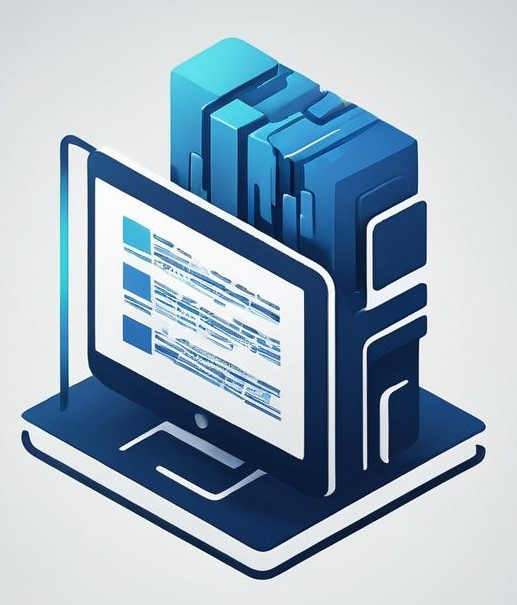
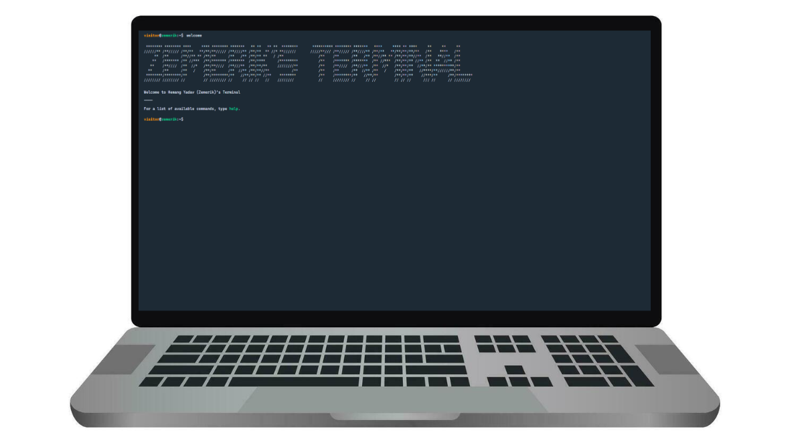
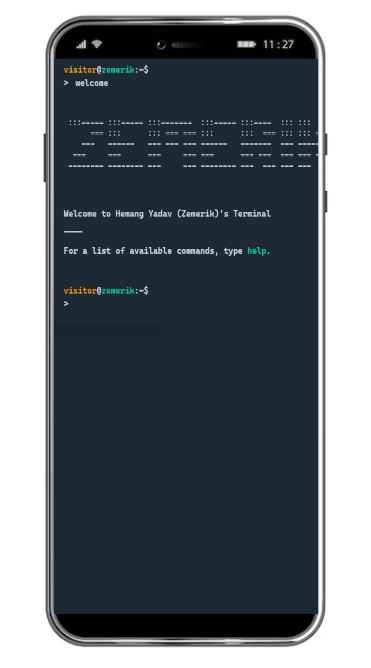

<p align = "center">



<br>

<br>


</p>

<h1 align = "center">
  Zemerik's Terminal
</h1>

<p align = "center">
    An Interactive Terminal
</p>

<p align = "center">
  
</p>


## ❗About:

Welcome to my personal terminal-themed website! Dive into an interactive experience where you can explore my world through a classic command-line interface. Just type in the provided commands to learn more about my background, skills, projects, and interests. Whether you're here to discover my professional journey, check out my portfolio, or just curious about who I am, this website offers a unique, nostalgic way to connect. Get ready to type, discover, and enjoy the seamless blend of modern content with a retro touch!

## ⭐ Key Features:

- Interactive Command-Line Interface:

- Skills

- Projects

- Responsive Design

- User-Friendly Commands

## 📱 Guide:

### Commands:

- `about` - About Zemerik
- `clear` - Clear the Terminal
- `education` - Education Background
- `email` - Contact Me through my Email
- `history` - View Command History
- `projects` - View all my Projects
- `pwd` - Your Current Working Directory
- `socials` - Follow Zemerik around the Web
- `welcome` - Display Welcome Section
- `whoami` - Get to Know who you are

### Shortcuts:

- `Tab` / `Ctrl + i` - autocompletes the command
- `Up Arrow` - go back to previous command
- `Ctrl + l` - clear the terminal

> Feel free to open [Pull-Requests](https://github.com/Zemerik/Terminal/pulls) for more Commands / Shorcuts. 

## 💻 Screenshots:



## 🚀 Quick Start:

### Prerequisites:

- [NodeJS](https://nodejs.org) installed on your machine
- [GIT](https://git-scm.com) installed on your machine
- A Code Editor

### Cloning:

- To make a local copy of this Project on your machine, enter the following `GIT` Commmand in your Terminal:

```bash
git clone https://github.com/Zemerik/Terminal
```

### Installing Dependencies:

- To run this project locally, we first need to download a few `npm` dependencies by using the command below:

```bash
npm i
```

### Locally Running:

- We can locally run this Project on our Network and see the output using the following Command of `NodeJS`:

```bash
npm run dev
```

## 😎 Happy Coding!!

## 🤝 Contributing:

Contributions are always welcome and appreciated! **Kindly visit the [CONTRIBUTING.md](https://github.com/Zemerik/Terminal/blob/main/CONTRIBUTING.md) file for more information**


## 💁 Support:

For any kind of support or inforrmation, you are free to join our **Discord Server**,

<a href = "https://discord.gg/UF9KsmuGbr">
  
</a>

#

<p align = "center">
  Don't forget to leave a ⭐
  <br>
  Made with 💖 by <a href = "https://github.com/Zemerik">Hemang Yadav (Zemerik)</a>
</p>
